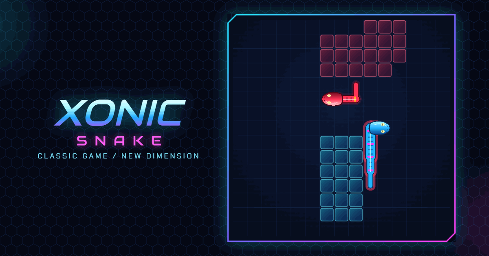

# Xonic Snake

**[▶ Play](https://territory-snake.vercel.app)** — https://territory-snake.vercel.app (best on a phone)

[](https://territory-snake.vercel.app)

A real-time territory game for the mobile browser, with two modes:

- **Duel** — you against an AI bot (Easy or Normal) on a 15×15 grid; single-player, there is no human opponent. Leave your territory to draw a trail, come back to close the loop and capture everything inside, and cut the bot's trail before it cuts yours. Both snakes move at the same time, one cell per tick. A match lasts two minutes.
- **Solo** — one snake on a 20×20 field whose frame is your land. Balls bounce around the empty part; close a loop and every area without a ball becomes yours. A ball touching your trail costs one of three lives. Capture 75% to reach the next level, with one more ball.

In both modes the snake moves on its own; you only steer.

Two looks, switched in the menu (1986 | 2026):

- **2026** (default) — neon sci-fi: a PixiJS board with glass land panels, snakes as continuous tapered bodies with turning heads, glowing orbs and smooth movement between cells; capture waves, particles, danger glow, death and shockwave effects; chamfered panels, a round pad and Audiowide / Chakra Petch type.
- **1986** — the original 8-bit look: a blue frame, solid land and hatched trails, a pixel font and blinking, step-by-step effects.

Reduced motion turns effects off in both looks (and makes the 2026 board move cell by cell).

Built as a portfolio project and a game-design experiment: the rules are specified up front, the engine is pure and tested, and the bot is explainable.

## Play

**https://territory-snake.vercel.app** — best on a phone. Add `?perf` to the URL to see tick timing, frames per second and board frame time, and copy a performance report from the end screen. If ticks run late on the 2026 board, the game offers to switch to 1986 once.

## Run it

```bash
npm install
npm run dev       # dev server
npm run build     # static build in dist/ (relative paths, deployable to any sub-folder)
npm run preview   # serve the build locally
```

Controls: swipe on the board or tap the D-pad on phones; arrow keys or WASD on desktop. Space or P pauses (hiding the tab pauses too). The menu picks the mode (Duel / Solo), the bot for Duel (Easy / Normal) and the speed (Slow 400 ms, Normal 280 ms, Fast 180 ms per tick).

## Tests and benchmark

```bash
npm test          # unit tests, 2000-game invariant stress tests for Duel and Solo, a quick bot smoke match
npm run bench     # full bot tournament: win rates, P1/P2 balance, move timing (~1.5 min)
```

## Architecture

- `src/engine/` — the game rules as pure TypeScript with no UI imports: `createInitialState`, `getLegalMoves`, `resolveRound` → `{ state, events }`, the capture algorithm and runtime invariants.
- `src/engine/solo/` — Solo on top of the same legal moves, trail update and capture: `createSoloState`, `resolveSoloTick` → `{ state, events }`, seeded bouncing balls, lives and levels, invariants S1–S6.
- `src/bot/` — computer opponents built only on the public game state: position analysis (distance home, distance to a trail, potential capture), `randomBot`, `safeBot`, `normalBot` (a one-round maximin over a weighted evaluation, weights in `NORMAL_CONFIG`, choices explained by `explainMove`) and `easyBot` on top of it (`EASY_CONFIG`: slower reactions, mistakes, less caution).
- `src/game/` — the real-time loop without React: a shared tick controller with an injectable clock (countdown, drift-free ticks, pause), the two-press input queue and the wall rule. The Duel match computes bot decisions as generators in small slices between ticks; the Solo match adds short in-game holds (a lost life, a cleared level) before the next countdown.
- `src/render/` — the renderers: the board behind one interface, `BoardRenderer` (`mount` / `update` on each tick / `frame(alpha)` on each animation frame / `resize` / `destroy`). Adapters turn a Duel or Solo state into a neutral `RenderSnapshot` (land by cell, trails as ordered cell lists, heads, balls). `Dom8bitRenderer` is the 1986 board; `Pixi2026Renderer` (PixiJS v8, lazy-loaded chunk, WebGL with a Canvas fallback) draws the 2026 one from pure geometry helpers (body polyline, tail taper, arc-length dashes, interpolation).
- `src/render/pixi2026/` — the 2026 board: land cached in a RenderTexture (only changed cells are redrawn), per-snake render groups, sprite pools for particles, effects played only from engine events.
- `src/ui/` — React + Tailwind screens (menu, how to play, game, pause) that drive the match controller and draw its state and events; no game logic lives here. `src/ui26/` holds the 2026 versions of the screens.
- The UI turns engine events into readable feedback: head movement, capture flashes, a one-line round summary, a trail-danger warning and an explained end screen.
- Playtest stats are kept in `localStorage` (`ts_stats` for Duel, `ts_solo` for Solo, `ts_games` for every game) and can be exported as JSON from the menu.

The rules are the single source of truth: see [GAME_RULES.md](GAME_RULES.md) for Duel and [SOLO_RULES.md](SOLO_RULES.md) for Solo. The 2026 look is specified in [VISUAL_2026.md](VISUAL_2026.md). Product context is in [PRD.md](PRD.md).

## How it was built

Development followed specifications written in Markdown before the code: the rules ([GAME_RULES.md](GAME_RULES.md), [SOLO_RULES.md](SOLO_RULES.md)) with numbered test scenarios, the visual spec ([VISUAL_2026.md](VISUAL_2026.md)) and the product brief ([PRD.md](PRD.md)). Work went in short sessions, each with a written task, per-step commits and a report with measurements (stress tests, frame and tick timing, bundle size, pixel comparison of the 1986 screens).

The code was written with [Claude Code](https://claude.com/claude-code).

## Screenshots

2026:

| Menu | How to play | Duel | Capture wave | Trail in danger |
|---|---|---|---|---|
|  |  |  |  |  |

| Solo | Ball hit | Level clear | Game over | Pause |
|---|---|---|---|---|
|  |  |  |  |  |

1986 board, Duel:

| Menu | How to play | Game | End screen |
|---|---|---|---|
|  |  |  |  |

1986 board, Solo:

| How to play | Game | Ball hit | Level clear | End screen |
|---|---|---|---|---|
|  |  |  |  |  |
