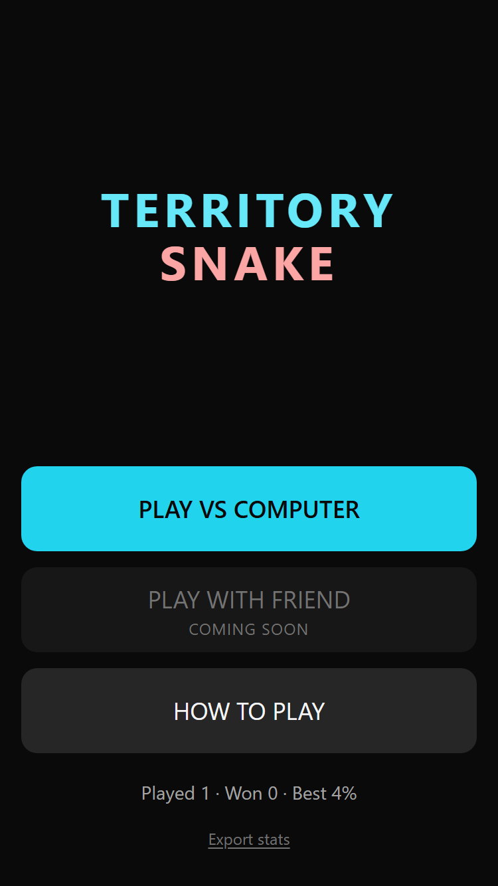
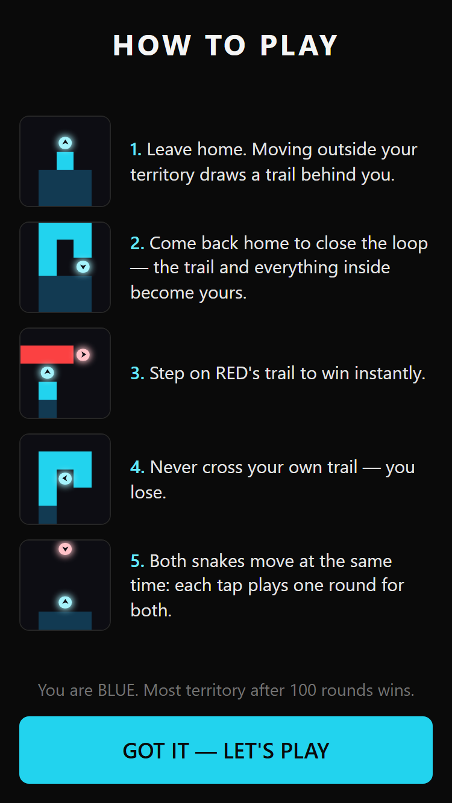
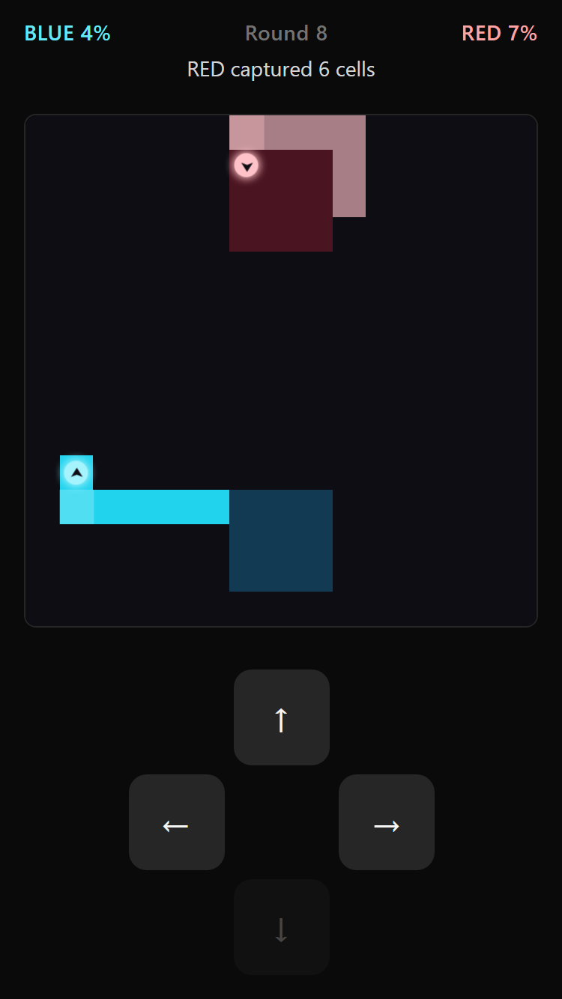
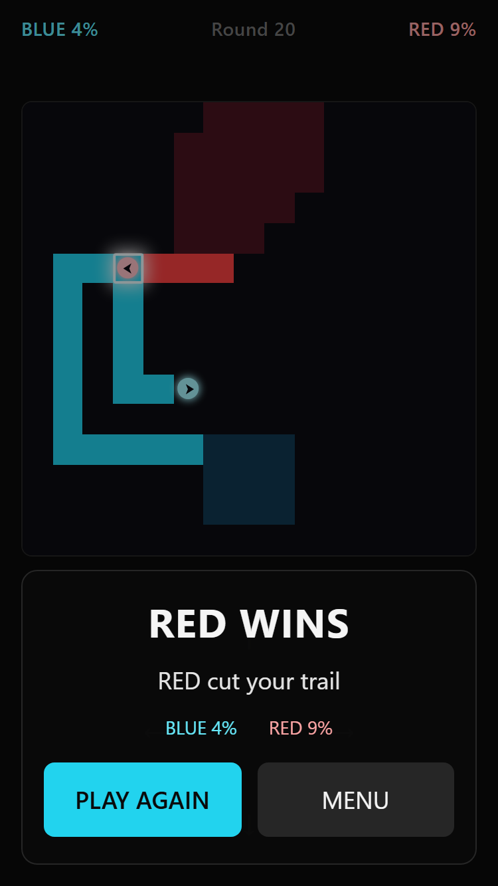

# Territory Snake

A turn-based territory duel for the mobile browser. You and the computer each steer a snake on a 15×15 grid: leave your territory to draw a trail, come back to close the loop and capture everything inside, and cut the opponent's trail before they cut yours. Both snakes move at the same time, so every tap is a small bet on what the other side will do.

Built as a portfolio project and a game-design experiment: the rules are specified up front, the engine is pure and tested, and the bot is explainable.

## Run it

```bash
npm install
npm run dev       # dev server
npm run build     # static build in dist/ (relative paths, deployable to any sub-folder)
npm run preview   # serve the build locally
```

Controls: on-screen D-pad on phones; arrow keys or WASD on desktop.

## Tests and benchmark

```bash
npm test          # unit tests, a 2000-game invariant stress test and a quick bot smoke match
npm run bench     # full bot tournament: win rates, P1/P2 balance, move timing (~40 s)
```

## Architecture

- `src/engine/` — the game rules as pure TypeScript with no UI imports: `createInitialState`, `getLegalMoves`, `resolveRound` → `{ state, events }`, the capture algorithm and runtime invariants.
- `src/bot/` — computer opponents built only on the public game state: position analysis (distance home, distance to a trail, potential capture), `randomBot`, `safeBot`, and `normalBot`, a one-round maximin over a weighted evaluation whose weights live in `NORMAL_CONFIG` and whose choices `explainMove` can break down.
- `src/ui/` — React + Tailwind screens (menu, how to play, game) that call the engine and draw its state and events; no game logic lives here.
- The UI turns engine events into readable feedback: head movement, capture flashes, a one-line round summary, a trail-danger warning and an explained end screen.
- Playtest stats are kept in `localStorage` (`ts_stats`, `ts_games`) and can be exported as JSON from the menu.

The rules are the single source of truth: see [GAME_RULES.md](GAME_RULES.md). Product context is in [PRD.md](PRD.md).

## Screenshots

| Menu | How to play | Game | End screen |
|---|---|---|---|
|  |  |  |  |
