# Xonic Snake

[](https://github.com/brookyuri/xonic-snake/actions/workflows/ci.yml)

<a href="https://territory-snake.vercel.app">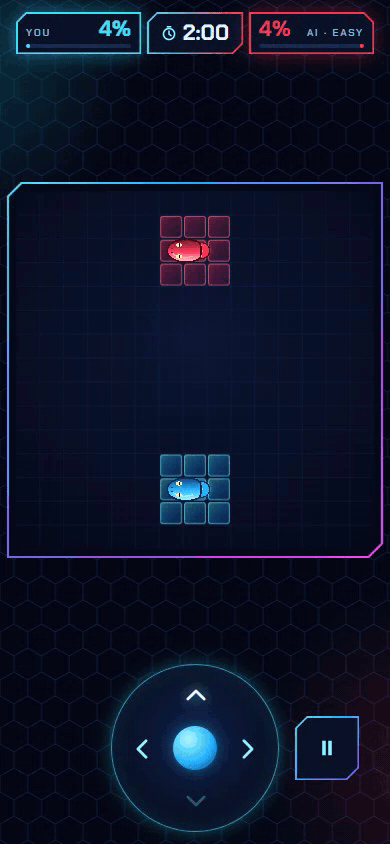</a>

**[▶ Play](https://territory-snake.vercel.app)** — https://territory-snake.vercel.app (best on a phone)

A real-time territory game for the mobile browser, with two modes:

- **Duel** — you against an AI bot (Easy or Normal) on a 15×15 grid; single-player, there is no human opponent. Leave your territory to draw a trail, come back to close the loop and capture everything inside, and cut the bot's trail before it cuts yours. Both snakes move at the same time, one cell per tick. A match lasts two minutes.
- **Solo** — one snake on a 20×20 field whose frame is your land. Balls bounce around the empty part; close a loop and every area without a ball becomes yours. A ball touching your trail costs one of three lives. Capture 75% to reach the next level, with one more ball.

In both modes the snake moves on its own; you only steer.

Two looks, switched in the menu (1986 | 2026):

- **2026** (default) — neon sci-fi: a PixiJS board with glass land panels, snakes as continuous tapered bodies with turning heads, glowing orbs and smooth movement between cells; capture waves, particles, danger glow, death and shockwave effects; chamfered panels, a round pad and Audiowide / Chakra Petch type.
- **1986** — the original 8-bit look: a blue frame, solid land and hatched trails, a pixel font and blinking, step-by-step effects.

Reduced motion turns effects off in both looks (and makes the 2026 board move cell by cell).

Built as a portfolio project and a game-design experiment: the rules are specified up front, the engine is pure and tested, and the bot is explainable.

## Play

**https://territory-snake.vercel.app** — best on a phone. Add `?perf` to the URL to see tick timing, frames per second and board frame time, and copy a performance report from the end screen. If ticks run late on the 2026 board, the game offers to switch to 1986 once.

## Run it

```bash
npm install
npm run dev       # dev server
npm run build     # static build in dist/ (relative paths, deployable to any sub-folder)
npm run preview   # serve the build locally
```

Controls: swipe on the board or tap the D-pad on phones; arrow keys or WASD on desktop. Space or P pauses (hiding the tab pauses too). The menu picks the mode (Duel / Solo), the bot for Duel (Easy / Normal) and the speed (Slow 400 ms, Normal 280 ms, Fast 180 ms per tick).

## Tests and benchmark

```bash
npm test          # unit tests, 2000-game invariant stress tests for Duel and Solo, a quick bot smoke match
npm run bench     # full bot tournament: win rates, P1/P2 balance, move timing (~1.5 min)
```

## By the numbers

Measured on 2026-09-29 on this repository (`npm test`, `npm run bench`, a production build in headless Chromium on an Intel UHD laptop GPU).

- **Tests:** 257 unit and scenario tests in 30 files (`npm test`).
- **Stress, Duel:** 2000 seeded random-vs-random games; the state invariants are checked after every round — 0 violations.
- **Stress, Solo:** 2000 seeded random-snake games (up to 3000 ticks each); invariants checked after every tick — 0 violations.
- **Bot benchmark** (`npm run bench`, seed 20260926, sides alternate), Normal bot win rate:

  | Normal vs | Games | Wins | Losses | Draws |
  |---|---|---|---|---|
  | random | 500 | 100.0% | 0.0% | 0.0% |
  | safe | 500 | 99.2% | 0.6% | 0.2% |
  | easy | 500 | 75.2% | 24.2% | 0.6% |

  Normal bot move time: 0.26 ms mean, 0.85 ms p99 over 105,159 moves.
- **Performance** (Fast speed, 180 ms per tick, 375×667, 45 s per run, no CPU throttling): 0 late ticks in Duel and Solo in both looks. 2026 board frame time: 0.81 ms average / 1.6 ms p95 in Solo, 1.03 ms / 1.9 ms in Duel, ~59 FPS; single frames reach ~33 ms.
- **Bundle (gzip):** main JS 74.8 KB; the PixiJS code loaded for the 2026 board, as separate lazy chunks, 119.9 KB (core 81.2 + WebGL 19.7 + render targets 14.9 + 4.1). The 1986 look never downloads it.

## Architecture

- `src/engine/` — the game rules as pure TypeScript with no UI imports: `createInitialState`, `getLegalMoves`, `resolveRound` → `{ state, events }`, the capture algorithm and runtime invariants.
- `src/engine/solo/` — Solo on top of the same legal moves, trail update and capture: `createSoloState`, `resolveSoloTick` → `{ state, events }`, seeded bouncing balls, lives and levels, invariants S1–S6.
- `src/bot/` — computer opponents built only on the public game state: position analysis (distance home, distance to a trail, potential capture), `randomBot`, `safeBot`, `normalBot` (a one-round maximin over a weighted evaluation, weights in `NORMAL_CONFIG`, choices explained by `explainMove`) and `easyBot` on top of it (`EASY_CONFIG`: slower reactions, mistakes, less caution).
- `src/game/` — the real-time loop without React: a shared tick controller with an injectable clock (countdown, drift-free ticks, pause), the two-press input queue and the wall rule. The Duel match computes bot decisions as generators in small slices between ticks; the Solo match adds short in-game holds (a lost life, a cleared level) before the next countdown.
- `src/render/` — the renderers: the board behind one interface, `BoardRenderer` (`mount` / `update` on each tick / `frame(alpha)` on each animation frame / `resize` / `destroy`). Adapters turn a Duel or Solo state into a neutral `RenderSnapshot` (land by cell, trails as ordered cell lists, heads, balls). `Dom8bitRenderer` is the 1986 board; `Pixi2026Renderer` (PixiJS v8, lazy-loaded chunk, WebGL with a Canvas fallback) draws the 2026 one from pure geometry helpers (body polyline, tail taper, arc-length dashes, interpolation).
- `src/render/pixi2026/` — the 2026 board: land cached in a RenderTexture (only changed cells are redrawn), per-snake render groups, sprite pools for particles, effects played only from engine events.
- `src/ui/` — React + Tailwind screens (menu, how to play, game, pause) that drive the match controller and draw its state and events; no game logic lives here. `src/ui26/` holds the 2026 versions of the screens.
- The UI turns engine events into readable feedback: head movement, capture flashes, a one-line round summary, a trail-danger warning and an explained end screen.
- Playtest stats are kept in `localStorage` (`ts_stats` for Duel, `ts_solo` for Solo, `ts_games` for every game) and can be exported as JSON from the menu.

The rules are the single source of truth: see [GAME_RULES.md](GAME_RULES.md) for Duel and [SOLO_RULES.md](SOLO_RULES.md) for Solo. The 2026 look is specified in [VISUAL_2026.md](VISUAL_2026.md). The original turn-based concept is kept as history in [docs/history/PRD-v0.1.md](docs/history/PRD-v0.1.md).

## Design decisions

- **Simultaneous moves, "strike first".** Both snakes move in the same tick, and a round resolves in a fixed order: movement, head-on, hits on trails (using trails from the start of the round), then captures. If I close a loop in the same round the opponent steps on my still-open trail, I die and the capture is not applied (rule T07). One written order makes every tie explicit and testable.
- **Capture as connected components with exclusions.** Instead of flood-filling from the border, the empty cells are split into 4-connected components with the player's land and trail as walls; a component is excluded if it holds an excluded cell — the enemy head in Duel, a ball in Solo — and everything else is captured. The same `computeCapture` serves both modes, the bot and the stress tests.
- **An explainable bot.** The Normal bot is a one-round maximin: for each of its legal moves it takes the worst case over the human's replies and scores the result with a weighted sum (territory, potential capture, danger, attack, greed, dead ends). `explainMove` prints the per-term scores, so a surprising move can be traced to a weight. No ML and no LLM; the Easy bot is the same search with slower reactions and deliberate mistakes.
- **Invariants and seeded stress tests.** Engine states are checked against written invariants (the trail layer on the board equals the trail lists, heads are on own land or at the end of their trail, …) after every round in tests and in 2000-game seeded stress runs. The "ghost trail" bug — captured cells kept their old trail layer, so a later visit to safe land killed the wrong player — was found in a manual playtest; its fix became invariant I1, so any regression now fails the stress run.
- **Pure engine, injectable clock.** The rules are pure functions (`state + moves → state + events`) with no timers or UI. The real-time loop is a small controller with an injectable clock (countdown, drift-free ticks, pause, input queue), so tick timing is unit-tested with fake clocks and the same engine plays the 2,700-game bot tournament headless in about 36 s.
- **One renderer interface, two looks.** `BoardRenderer` (`mount` / `update` per tick / `frame(alpha)` per animation frame) has a DOM implementation for 1986 and a PixiJS one for 2026, fed by a neutral snapshot built from engine state. The budget was set first (0 late ticks at Fast, frame ≤ 16 ms); profiling drove the fixes: land cached in a RenderTexture with per-cell redraws, straight moving segments as stretched sprites, alpha instead of `visible` toggles, per-snake render groups, and a warm-up during the countdown. After the renderer refactor the 1986 screens were checked pixel-for-pixel against the previous build.
- **Spec-driven workflow.** [GAME_RULES.md](GAME_RULES.md), [SOLO_RULES.md](SOLO_RULES.md) and [VISUAL_2026.md](VISUAL_2026.md) were written before the code, with numbered scenarios that became tests. The implementation was done with Claude Code in sessions; each session had a written task and ended with per-step commits and a report (tests, stress results, timings, screenshots) that was reviewed before the next one.

## How it was built

Development followed specifications written in Markdown before the code: the rules ([GAME_RULES.md](GAME_RULES.md), [SOLO_RULES.md](SOLO_RULES.md)) with numbered test scenarios, the visual spec ([VISUAL_2026.md](VISUAL_2026.md)) and the original product brief ([docs/history/PRD-v0.1.md](docs/history/PRD-v0.1.md)). Work went in short sessions, each with a written task, per-step commits and a report with measurements (stress tests, frame and tick timing, bundle size, pixel comparison of the 1986 screens).

The code was written with [Claude Code](https://claude.com/claude-code).

## Screenshots

2026:

| Menu | How to play | Duel | Capture wave | Trail in danger |
|---|---|---|---|---|
| 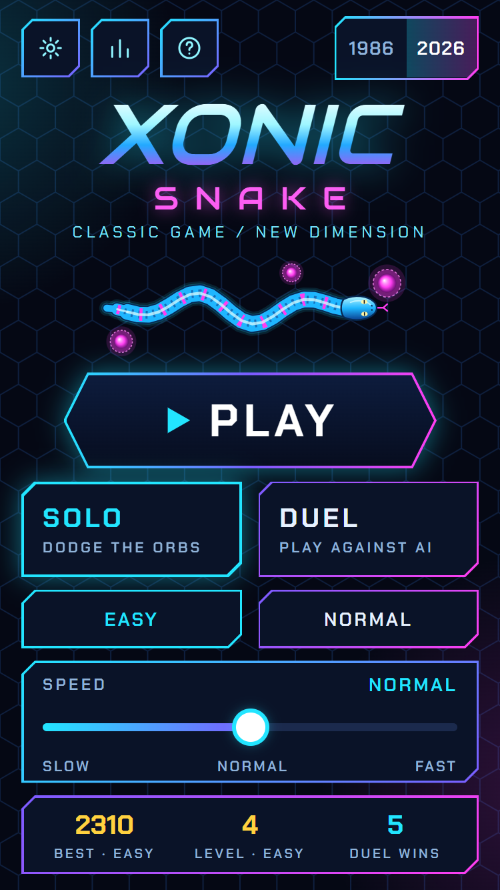 | 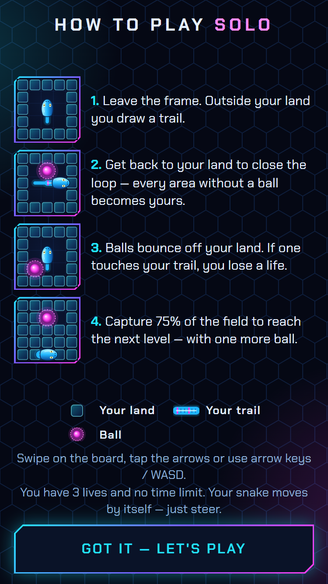 | 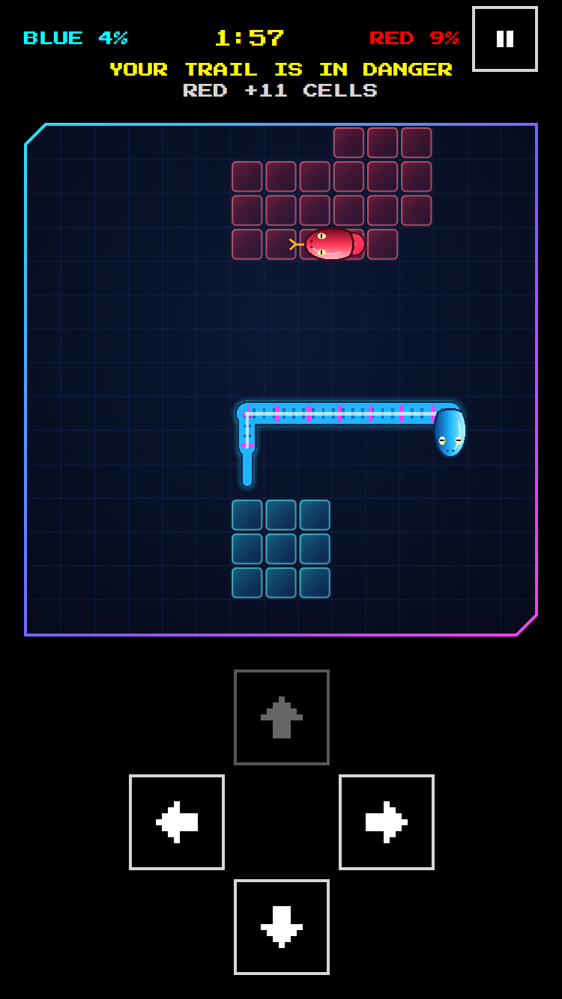 | 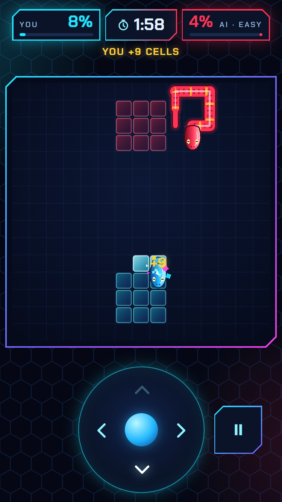 | 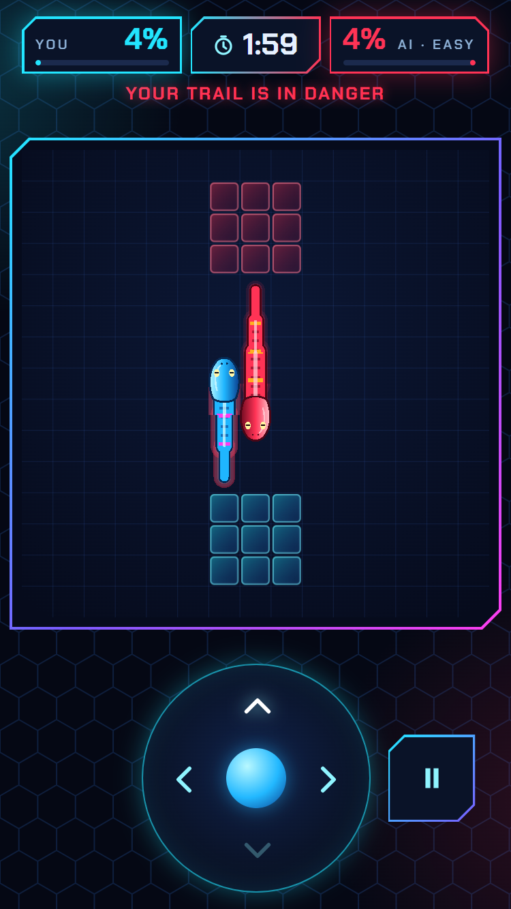 |

| Solo | Ball hit | Level clear | Game over | Pause |
|---|---|---|---|---|
| 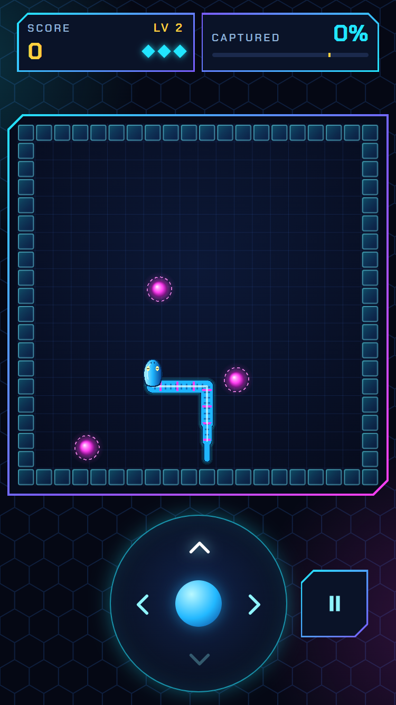 | 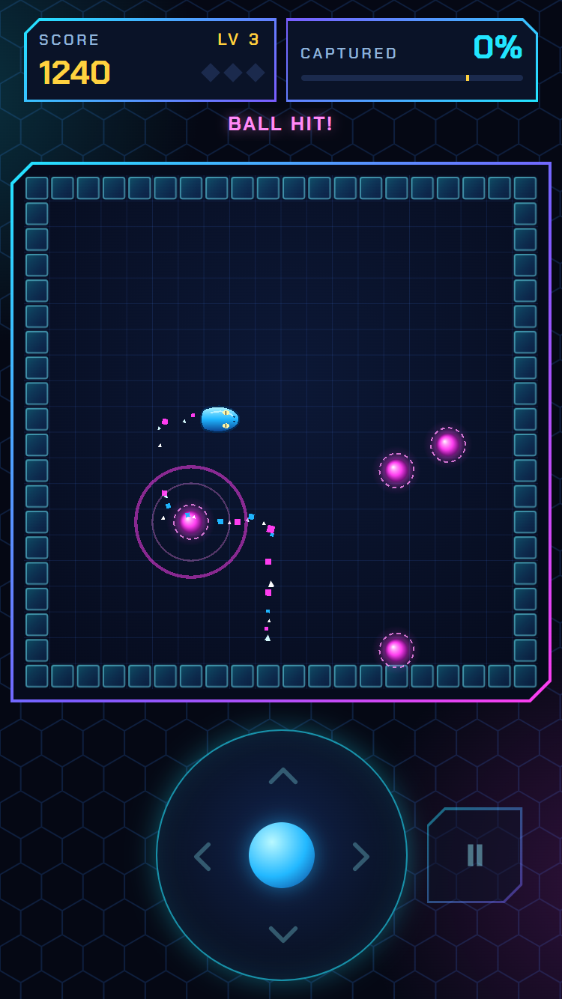 | 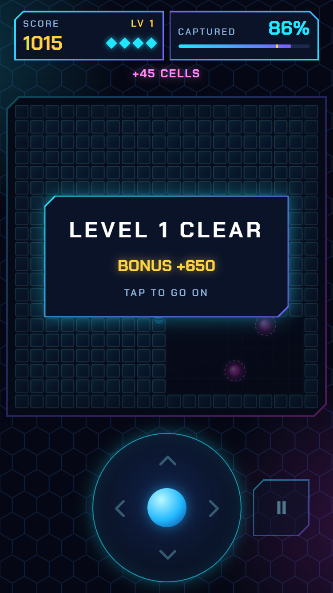 | 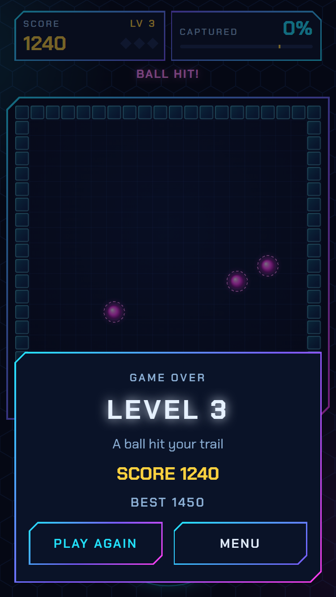 | 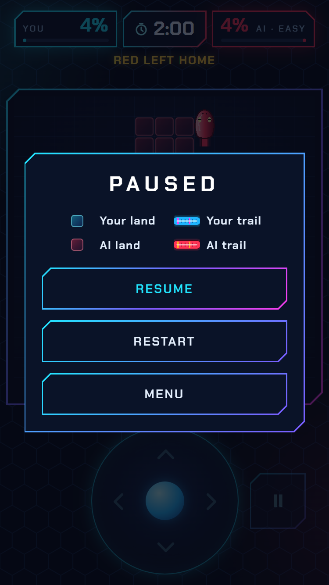 |

1986 board, Duel:

| Menu | How to play | Game | End screen |
|---|---|---|---|
|  |  |  |  |

1986 board, Solo:

| How to play | Game | Ball hit | Level clear | End screen |
|---|---|---|---|---|
| 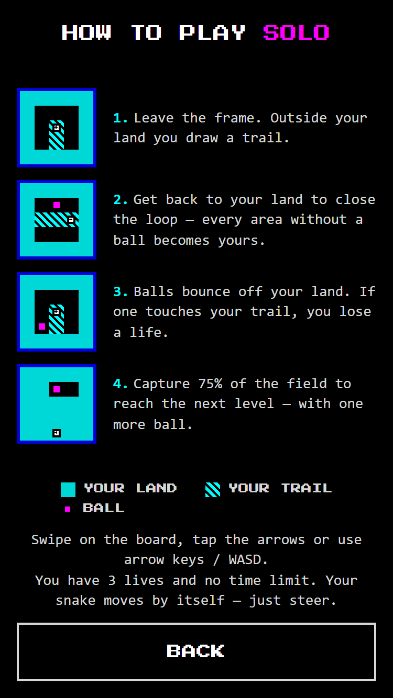 | 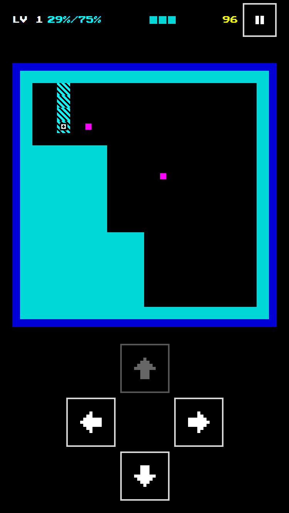 | 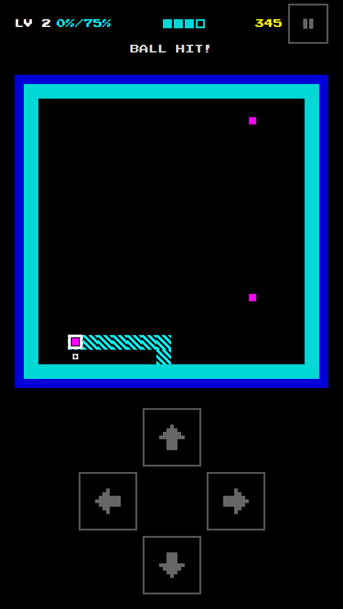 | 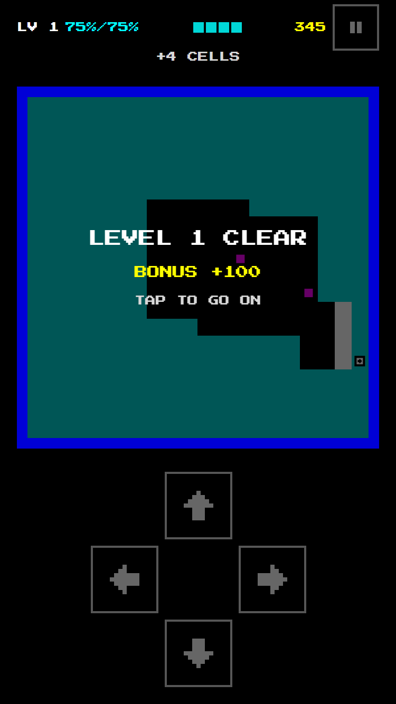 | 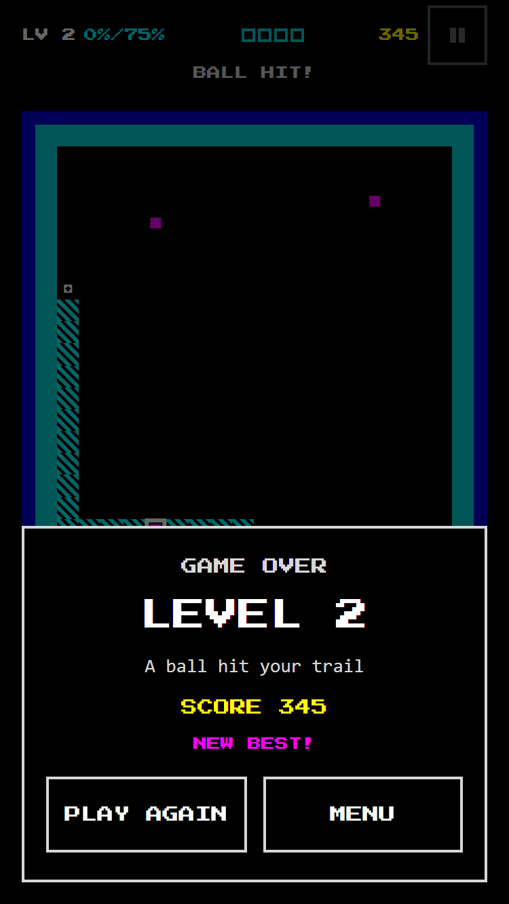 |
